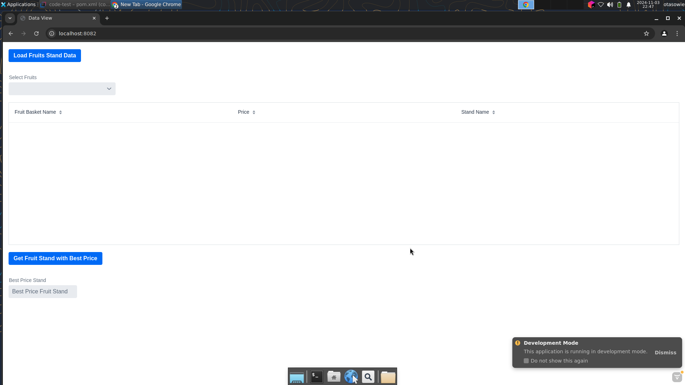
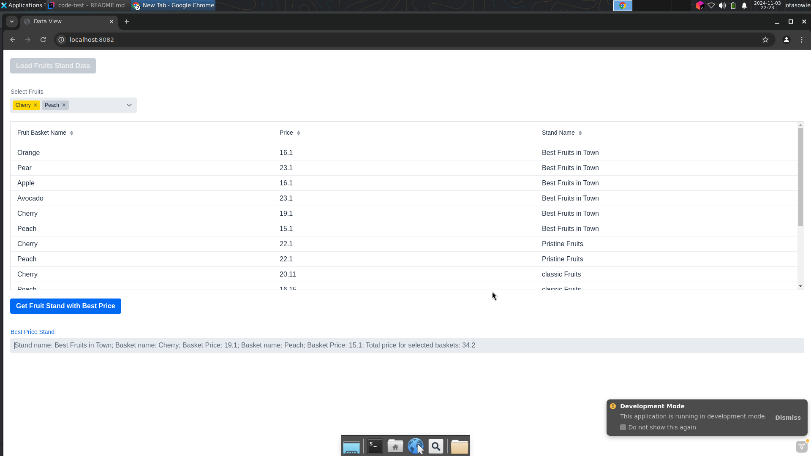

# Code Test
A simple springboot web that was developed as part of a code test. The app uses an in memory H2 db for testing and persistence. The frontend i based on the Vaadin Java based framework: 
[Vaadin](https://vaadin.com/). The packages needed for the Vaadin frontend are in this repository. In this way, there will be no need to rebuild the frontend bundles unless changes have been made to the views or the styling.

On localhost, the port number for the server is 8082; ie localhost:8082. On navigating to the main page, the screen should is similar to the screenshot below: 

On the page, the first button is used to load data into the H2 db (this can be done in many ways but i used this for simplicity). When the user presses this button, the combo box is filled with data. The grid is also filled with data in order to present more information to the user. The user can select fruits from the drop down list in the combo box. The loaded data is simple. It could be possible to add more data to the system but, I have not implemented that in the frontend. The backend handles adding new baskets and stands

To get the fruit stand with the best price for the fruits that were selected in the combobox, the user can press the second button. The result is presented to the user in the text field below the second button as shown in the screenshot below: 

Run the application from the command line with maven: mvn spring-boot:run.

